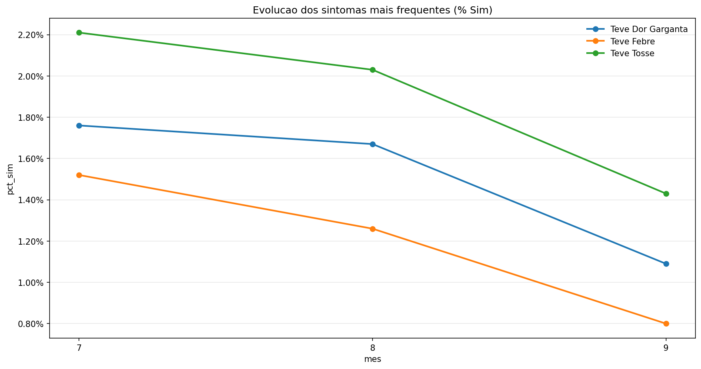
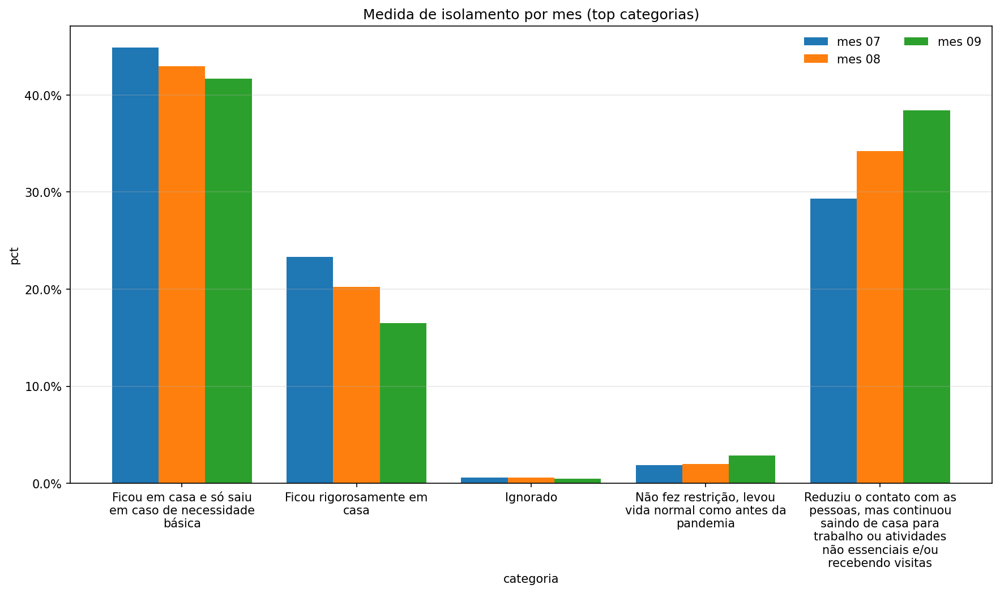
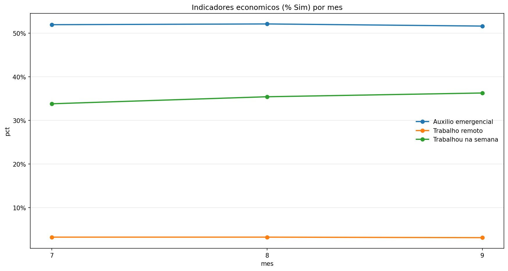
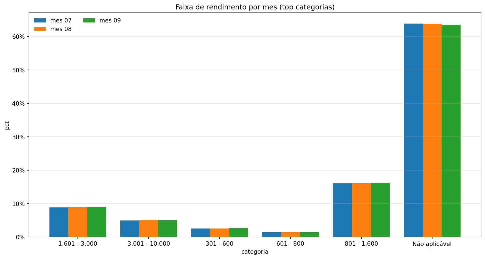

# Analise PNAD COVID-19 (base tratada)

## Contexto de extracao (AWS)
- A extracao dos microdados foi feita em bucket AWS (free tier).
- Scripts e credenciais nao ficam neste repo por serem temporarios.

## Pipeline
- Limpeza: `Limpeza_Base_PNAD.ipynb` (dados_tratados_completo.csv -> dados_tratados.csv).
- ETL: `ETL.ipynb` (tabelas gold e visoes).
- Graficos: `gerar_graficos.py` (imagens em relatorios/figuras).

## Cobertura dos dados
- Linhas: 1.157.984
- Meses: 07, 08, 09
- Colunas fonte: 20

## c) Caracterizacao dos sintomas clinicos
Grafico:

Principais sintomas (media do pct_sim no periodo):
| sintoma | pct_min | pct_max |
| --- | --- | --- |
| Teve Dor Garganta | 1.09% | 1.76% |
| Teve Febre | 0.80% | 1.52% |
| Teve Tosse | 1.43% | 2.21% |

## d) Comportamento da populacao na COVID-19
Grafico (comparacao por mes):

Top categorias em medida_isolamento no mes 09:
| categoria | pct |
| --- | --- |
| Ficou em casa e so saiu em caso de necessidade basica | 41.68% |
| Reduziu o contato com as pessoas, mas continuou saindo de casa para trabalho ou atividades nao essenciais e/ou recebendo visitas | 38.44% |
| Ficou rigorosamente em casa | 16.49% |

## e) Caracteristicas economicas da sociedade
Grafico (indicadores ao longo dos meses):

Indicadores (pct_sim) no mes 09:
| indicador | pct_sim |
| --- | --- |
| Auxilio emergencial | 51.61% |
| Trabalho remoto | 3.11% |
| Trabalhou na semana | 36.27% |

Grafico (faixa de rendimento por mes):

Top faixas de rendimento no mes 09:
| categoria | pct |
| --- | --- |
| Nao aplicavel | 63.58% |
| 801 - 1.600 | 16.24% |
| 1.601 - 3.000 | 8.91% |

## Saidas do ETL
- gold_sintomas_mes.csv
- gold_sintomas_perfil.csv
- gold_economia_mes.csv
- gold_comportamento_mes.csv
- gold_sintomas_frequentes_mes.csv
- frequencia_sintomas.csv
